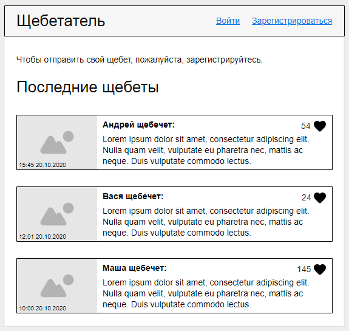
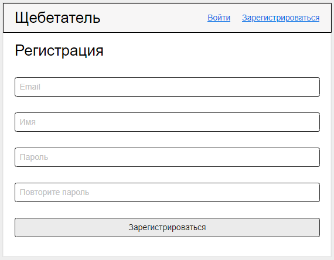
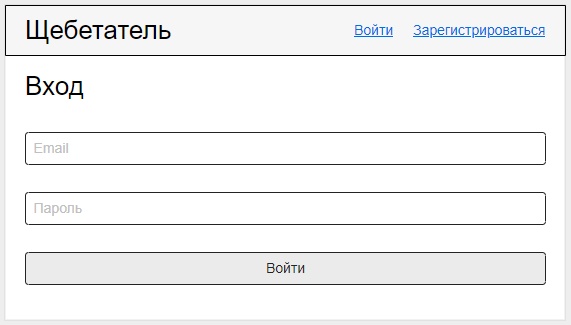
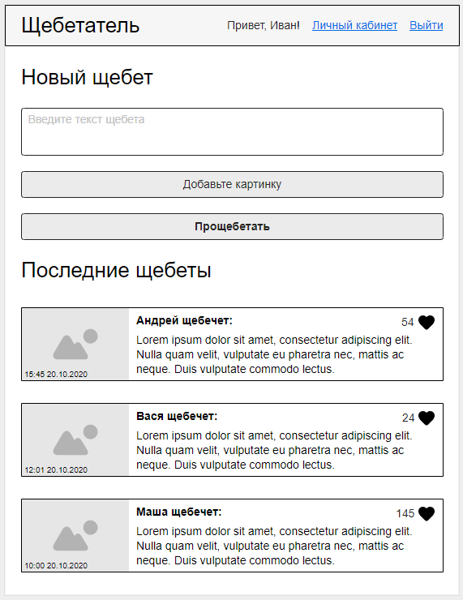
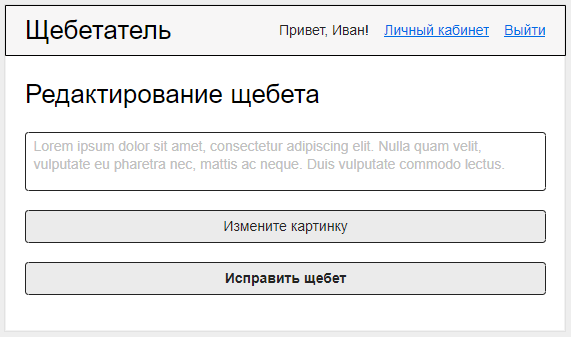

# Щебетатель

## Введение

Тебе предстоит создать уникальный сервис - "Щебетатель".
Щебет - это короткое текстовое сообщение с картинкой. Пользователи будут 
оставлять такие сообщения и лайкать сообщения других пользователей.

### Важно
Делай `git push` только один раз — не раньше, чем за полчаса до окончания экзамена. 
В течение экзамена ничего пушить не нужно!

### Рекомендации
1. Прочитай всё задание целиком.
   
2. Сфокусируйся на функционале приложения, оценивать будем в первую очередь его. 

    Красивая вёрстка — это приятно, но может затратить слишком много времени.

3. Сделай навигацию по сайту — пользователь должен иметь возможность добраться до любой страницы через элементы на страницах — ссылки, формы, etc.
  
    Не заставляй пользователя лезть в DevTools или, что ещё хуже, в исходный код приложения.

4. Если не получается сделать какой-то релиз, переходи к следующему.

## Release 0. Подготовка к работе

Проверь, что есть в проекте. Проверь содержимое package.json, .gitignore и остальных файлов. Дополни при необходимости. Установи зависимости, которые будешь использовать в работе.

Задай NPM-скрипты:
- start — обязательно
- dev — очень желательно

Подумай, из каких частей будет состоять твоё приложение, спроектируй базу данных.

## Release 1: Главная страница

Если пользователь не аутентифицирован, он увидит перед собой главную страницу.

На ней будет список последних щебетов. Каждый щебет состоит из:
* Картинки
* Даты отправки
* Имени отправителя
* Текста сообщения
* Количества лайков

В шапке есть заголовок, который переводит на главную страницу, а также 
ссылки на `Вход` и `Регистрацию`.

## Release 2. Регистрация

Создай страницу регистрации с необходимыми полями:
* Email
* Имя
* Пароль

## Release 3. Вход

Создайте страницу входа с необходимыми полями:
* Email
* Пароль

## Release 4. Главная страница после аутентификации

После успешного входа главная страница немного изменяется.

В шапке появляется приветствие для аутентифицированного пользователя и 
ссылка на личный кабинет. А также кнопка выхода из системы.

Самое важное - мы можем добавить свой собственный щебет. Для этого нам нужно 
ввести текст сообщения, добавить картинку и нажать кнопку "Прощебетать".

Добавленный щебет должен появиться в списке последних щебетов.

## Release 5. Лайки

Добавь возможность ставить лайки любому щебету. Лайк должен добавляться
при нажатии на сердечко в правом верхнем углу.

## Release 6. Личный кабинет

Создай страницу личного кабинета. В нем также есть возможность добавить 
новый щебет.

Помимо этого, можно просмотреть все собственные щебеты, а также удалить 
любой из них.

Заметь, что есть кнопка редактирования. Это следующий релиз.

## Release 7. Редактирование

При нажатии на кнопку редактирования мы оказываемся на соответствующей 
странице. Сделай так, чтобы щебет можно было поправить.

При этом не меняется время его создания.

## Release 8. Авторизация

Убедись, что другие пользователи не могут удалить или отредактировать 
твой щебет даже через `postman`. Также запрети возможность создавать 
щебеты неаутентифицированным пользователям.

## Release 9. Данные для демонстрации

Нет seeder-файла? Самое время его написать. Заполни базу щебетами от разных пользователей.

Если лайки готовы, добавь в базу записи о том, кто какой щебет лайкнул.

## Заключение

Ты можешь делать столько коммитов, сколько тебе нужно. Однако, пожалуйста, не исполняй команду `git push` до окончания экзамена. Не искушай своих одногруппников подсматривать твой код.
